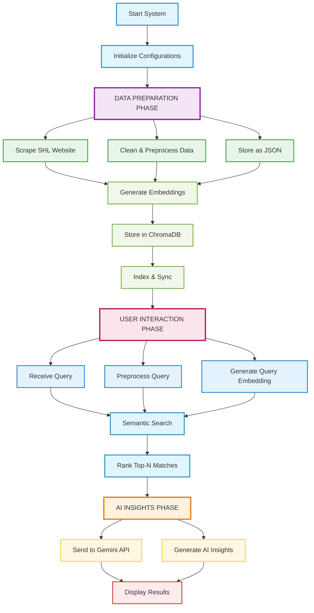

# TalentLens

[](https://img.shields.io/badge/status-operational-brightgreen)
[](https://img.shields.io/badge/python-3.9+-blue)
[](https://img.shields.io/badge/license-MIT-green)

**Note:** For the best experience with the Streamlit demo, we recommend viewing it in a browser with dark mode enabled.

## 🚀 Important Links

### 🎥 Demo Video

<a href="https://vimeo.com/1140349958">
  
</a>

### 🔹 **Live Demo (Streamlit App)**  
👉 https://talentlens-cimdbqsshfd37ja45o6mke.streamlit.app/

## Overview
TalentLens is an AI-powered recommendation engine designed to streamline the process of selecting SHL assessments for specific job roles. By leveraging natural language processing and semantic search, it helps HR professionals quickly identify the most relevant tests from SHL's extensive catalog, reducing manual effort and improving hiring efficiency.

### The Challenge
HR teams often face difficulties in aligning job requirements with the right SHL assessments. This mismatch can lead to prolonged hiring cycles, suboptimal candidate evaluations, and increased operational costs.

### Our Approach
TalentLens addresses this by automating the discovery process: it scrapes SHL's product catalog, converts assessment descriptions into vector embeddings using NLP techniques, performs semantic matching against job descriptions, and delivers tailored recommendations along with actionable HR insights.

## Technology Stack
- **Backend:** FastAPI with Uvicorn for robust API handling
- **AI and Machine Learning:** ChromaDB for vector storage and retrieval, Sentence-Transformers for embedding generation
- **Natural Language Processing:** Gemini API for generating concise insights
- **Data Scraping:** BeautifulSoup and Requests for reliable web extraction
- **Frontend:** Streamlit for an intuitive user interface
- **Deployment:** Render for API hosting and Streamlit Cloud for the demo application

## How It Works
The system follows a structured pipeline to ensure reliable and scalable performance:

1. **Data Collection:** We scrape SHL's website to gather assessment details and store them in a structured JSON format (handled in `scraper.py`).
2. **Vector Database Setup:** Descriptions are transformed into embeddings and persisted in ChromaDB for efficient querying (via `rag.py`).
3. **API Processing:** User-submitted job descriptions are analyzed to retrieve and rank relevant assessments (in `api.py`).
4. **Insight Generation:** The Gemini API evaluates the top matches to produce summaries on key skills, job level suitability, and practical usage advice.
5. **User Interface:** The frontend accepts job descriptions as input and presents ranked recommendations with embedded insights and tips.

## Workflow


## Core Features
- **Semantic Search Capabilities:** Matches job requirements to assessments using vector similarity for precise, context-aware recommendations.
- **AI-Generated Insights:** Provides succinct overviews of required skills, ideal candidate levels, and implementation guidance to support HR decision-making.
- **Production-Ready Deployment:** Built with free-tier hosting in mind, ensuring easy access without complex setup.

## Development Insights
During implementation, we encountered a few hurdles and addressed them as follows:
- **Handling Complex Scraping:** Multi-level page navigation was managed through targeted selectors and error-resilient parsing.
- **API Rate Limits:** Cohere's free tier constraints were mitigated by implementing token limits to maintain response quality.
- **Database Path Issues:** ChromaDB initialization errors in deployed environments were resolved by switching to absolute file paths.

## Getting Started
### API Access
The recommendation endpoint is live and ready for integration.

**Endpoint URL:** [https://shl-assessment-recommendor.onrender.com/recommend](https://shl-assessment-recommendor.onrender.com/recommend)

**Example Request (JSON):**
```json
{
  "text": "We want to hire a Python expert!!"
}
```

**Example Response (JSON):**
```json
{
  "name": "Python (New)",
  "url": "https://www.shl.com/solutions/products/product-catalog/view/python-new/",
  "score": 0.9339699149131775,
  "ai_insights": "1. Key skills: Programming, databases, libraries\n\n2. Job level fit: Intermediate, experienced\n\n3. Usage tip: Prepare for the assessment……"
}
```

### Interactive Demo
Explore the full user interface via our hosted Streamlit app:  
[https://shl-assessment-recommendor-v75xtfd7tsh3rxqucbedlk.streamlit.app/](https://shl-assessment-recommendor-v75xtfd7tsh3rxqucbedlk.streamlit.app/)

## Screenshots


## Business Impact
This tool has the potential to cut HR assessment selection time by up to 80%, enabling faster and more accurate hiring decisions. Its cloud-based architecture supports scalability, positioning it as a valuable asset for optimizing talent acquisition workflows.


